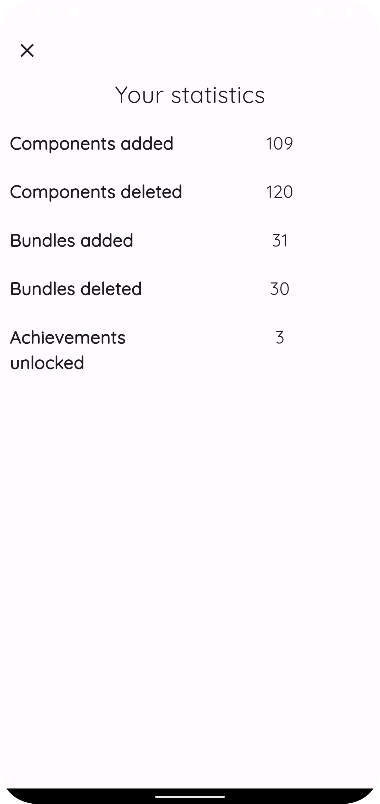

<!-- Improved compatibility of back to top link: See: https://github.com/othneildrew/Best-README-Template/pull/73 -->
<a name="readme-top"></a>
<!--
*** Thanks for checking out the Best-README-Template. If you have a suggestion
*** that would make this better, please fork the repo and create a pull request
*** or simply open an issue with the tag "enhancement".
*** Don't forget to give the project a star!
*** Thanks again! Now go create something AMAZING! :D
-->


<!-- PROJECT SHIELDS -->
<!--
*** I'm using markdown "reference style" links for readability.
*** Reference links are enclosed in brackets [ ] instead of parentheses ( ).
*** See the bottom of this document for the declaration of the reference variables
*** for contributors-url, forks-url, etc. This is an optional, concise syntax you may use.
*** https://www.markdownguide.org/basic-syntax/#reference-style-links
-->
[![Contributors][contributors-shield]][contributors-url]
[![Forks][forks-shield]][forks-url]
[![Stargazers][stars-shield]][stars-url]
[![Issues][issues-shield]][issues-url]
[![MIT License][license-shield]][license-url]
[![LinkedIn][linkedin-shield]][linkedin-url]


<!-- PROJECT LOGO -->
<br />
<div align="center">
  <a href="https://github.com/Necromunda/HealthCompanion">
    
  </a>

<h3 align="center">Health Companion</h3>

  <p align="center">
    Track your daily calorie and macro consumptions easily with this mobile application
    <br />
    <a href="https://github.com/Necromunda/HealthCompanion"><strong>Explore the docs »</strong></a>
    <br />
    <br />
    <a href="https://github.com/Necromunda/HealthCompanion">View Demo</a>
    ·
    <a href="https://github.com/Necromunda/HealthCompanion/issues">Report Bug</a>
    ·
    <a href="https://github.com/Necromunda/HealthCompanion/issues">Request Feature</a>
  </p>
</div>


<!-- TABLE OF CONTENTS -->
<details>
  <summary>Table of Contents</summary>
  <ol>
    <li>
      <a href="#about-the-project">About The Project</a>
      <ul>
        <li><a href="#built-with">Built With</a></li>
      </ul>
    </li>
    <li>
      <a href="#getting-started">Getting Started</a>
      <ul>
        <li><a href="#prerequisites">Prerequisites</a></li>
        <li><a href="#installation">Installation</a></li>
      </ul>
    </li>
    <li><a href="#usage">Usage</a></li>
    <li><a href="#roadmap">Roadmap</a></li>
    <li><a href="#contributing">Contributing</a></li>
    <!--<li><a href="#license">License</a></li>-->
    <li><a href="#contact">Contact</a></li>
    <li><a href="#acknowledgments">Acknowledgments</a></li>
  </ol>
</details>


<!-- ABOUT THE PROJECT -->
## About The Project

Calorie tracker app made as a small summer project

### Built With

* [![Dart][Dart]][Dart-url]
* [![Flutter][Flutter]][Flutter-url]

<p align="right">(<a href="#readme-top">back to top</a>)</p>


<!-- GETTING STARTED -->
## Getting Started

This is an example of how you may give instructions on setting up your project locally.
To get a local copy up and running follow these simple example steps or download it from [File.io](https://file.io/hdMcV9WQUWJr)

### Prerequisites

Install flutter and dart from their respective sources.

### Installation

1. Clone the repo
   ```sh
   git clone https://github.com/Necromunda/HealthCompanion.git
   ```
2. Install necessary packages
   ```sh
   flutter pub get
   ```
3. Build the app
   ```sh
   flutter build apk
   ```
4. Install the apk to your device

<p align="right">(<a href="#readme-top">back to top</a>)</p>


<!-- USAGE EXAMPLES -->
## Usage

|                           Sign in                            |         Overview          |                            Profile                            |
|:------------------------------------------------------------:|:-------------------------:|:-------------------------------------------------------------:|
|  |  |  |

|                        Create component                        |                           Statistics                           |                            Achievements                            |
|:--------------------------------------------------------------:|:--------------------------------------------------------------:|:------------------------------------------------------------------:|
|  |  |  |

<p align="right">(<a href="#readme-top">back to top</a>)</p>


<!-- ROADMAP -->
## Roadmap

- [x] Display macros in a chart
- [x] Change themes
- [x] Language support
    - [x] English
    - [x] Finnish
    - [ ] Others
- [x] Readme
- [ ] Publish to app store

See the [open issues](https://github.com/Necromunda/HealthCompanion/issues) for a full list of proposed features (and known issues).

<p align="right">(<a href="#readme-top">back to top</a>)</p>


<!-- CONTRIBUTING -->
## Contributing

Contributions are what make the open source community such an amazing place to learn, inspire, and create. Any contributions you make are **greatly appreciated**.

If you have a suggestion that would make this better, please fork the repo and create a pull request. You can also simply open an issue with the tag "enhancement".
Don't forget to give the project a star! Thanks again!

1. Fork the Project
2. Create your Feature Branch (`git checkout -b feature/AmazingFeature`)
3. Commit your Changes (`git commit -m 'Add some AmazingFeature'`)
4. Push to the Branch (`git push origin feature/AmazingFeature`)
5. Open a Pull Request

<p align="right">(<a href="#readme-top">back to top</a>)</p>


[//]: # (<!-- LICENSE -->)

[//]: # (## License)

[//]: # ()
[//]: # (Distributed under the MIT License. See `LICENSE.txt` for more information.)

[//]: # ()
[//]: # (<p align="right">&#40;<a href="#readme-top">back to top</a>&#41;</p>)


<!-- CONTACT -->
## Contact

Email: johannes.rantapaa@gmail.com

Project Link: [https://github.com/Necromunda/HealthCompanion](https://github.com/Necromunda/HealthCompanion)

<p align="right">(<a href="#readme-top">back to top</a>)</p>


<!-- ACKNOWLEDGMENTS -->

## Acknowledgments

* [Img Shields](https://shields.io)

* [Firebase](https://firebase.google.com/)

* [Jira](https://jrantapaa-health-companion.atlassian.net/jira/software/projects/HEAL/boards/1)


<p align="right">(<a href="#readme-top">back to top</a>)</p>


<!-- MARKDOWN LINKS & IMAGES -->
<!-- https://www.markdownguide.org/basic-syntax/#reference-style-links -->
[contributors-shield]: https://img.shields.io/github/contributors/Necromunda/HealthCompanion.svg?style=for-the-badge
[contributors-url]: https://github.com/Necromunda/HealthCompanion/graphs/contributors
[forks-shield]: https://img.shields.io/github/forks/Necromunda/HealthCompanion.svg?style=for-the-badge
[forks-url]: https://github.com/Necromunda/HealthCompanion/network/members
[stars-shield]: https://img.shields.io/github/stars/Necromunda/HealthCompanion.svg?style=for-the-badge
[stars-url]: https://github.com/Necromunda/HealthCompanion/stargazers
[issues-shield]: https://img.shields.io/github/issues/Necromunda/HealthCompanion.svg?style=for-the-badge
[issues-url]: https://github.com/Necromunda/HealthCompanion/issues
[license-shield]: https://img.shields.io/github/license/Necromunda/HealthCompanion.svg?style=for-the-badge
[license-url]: https://github.com/Necromunda/HealthCompanion/blob/master/LICENSE.txt
[linkedin-shield]: https://img.shields.io/badge/-LinkedIn-black.svg?style=for-the-badge&logo=linkedin&colorB=555
[linkedin-url]: https://linkedin.com/in/johannes-rantapää-565197230
[product-screenshot]: images/screenshot.png
[Dart]: https://img.shields.io/badge/dart-0769AD?style=for-the-badge&logo=dart&logoColor=white
[Dart-url]: https://dart.dev/
[Flutter]: https://img.shields.io/badge/flutter-20232A?style=for-the-badge&logo=flutter&logoColor=61DAFB
[Flutter-url]: https://flutter.dev/
